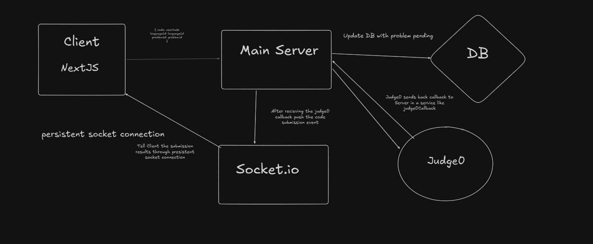

# AlgoMinds Backend

The backend for **AlgoMinds** – a scalable multiplayer competitive coding platform where users can compete in real-time coding matches, collaborate with friends, and enhance their problem-solving skills. This repository handles authentication, WebSocket-based code execution, game logic, AI integrations, and database management. The platform is still in early development! Want to collaborate in real-time with your friends? Stay updated on the launch of the platform!

---

## 🚀 Tech Stack

- **Node.js** + **Express.js** – Web framework & server
- **PostgreSQL** – Primary relational database
- **Prisma ORM** – Type-safe database access
- **Redis** – Real-time data & queue management
- **Socket.IO** – Real-time WebSocket communication
- **Judge0 API** – Code execution engine
- **Zod** – Schema validation
- **JWT** – Authentication via access/refresh tokens

## 🧠 Architecture: Real-Time Code Execution via WebSockets

AlgoMinds uses a WebSocket-based architecture to deliver a seamless real-time experience for multiplayer code execution. Here's how it works:

### 🔁 Submission Flow

1. **🧑‍💻 Client Submission**
   - The client sends a POST request to the backend containing:
     - Source code
     - Programming language
     - Room ID
     - Socket ID

2. **🗂️ Server Marks Submission as Pending**
   - The backend stores the submission in the database with a `status: PENDING`.

3. **🚀 Forward to Judge0**
   - The backend sends the code to the [Judge0 API](https://judge0.com/) with a `POST` request, using our API key and providing a `callbackUrl`.

4. **📥 Judge0 Callback**
   - Judge0 asynchronously executes the code and makes a `POST` request to our backend at the `judge0Callback` route with the execution result.

5. **📡 WebSocket Event Emission**
   - Our server fetches the user’s room using the `socketId` or `roomId` and emits a `submissionResult` event back through `socket.io`.

6. **⚡ Client Receives Result in Real-Time**
   - The client listens to `submissionResult` over the persistent WebSocket connection and updates the UI immediately.

### 🖼️ Diagram

> 📌 Below is a visual representation of the flow:

